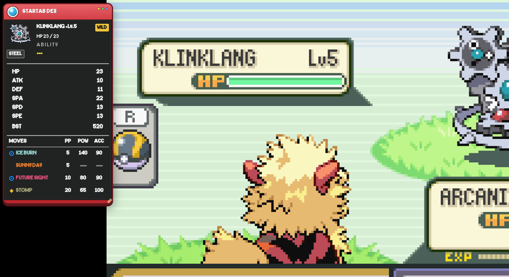

# StartAB Dex

Estensione Chrome quality of life per StartAB.

Rimane minimizzata durante il gioco e si apre automaticamente quando appare un Pokémon selvatico.

## Funzionalità

- Statistiche e BST del Pokémon avversario
- Tipi e abilità
- Moveset completo con PP, Potenza e Precisione
- Categoria Fisica / Speciale / Stato
- Colore delle mosse in base al tipo
- Interfaccia Pokédex trascinabile e ridimensionabile

## Installazione

1. Apri `chrome://extensions`
2. Attiva **Modalità sviluppatore**
3. Clicca **Carica estensione non pacchettizzata**
4. Seleziona la cartella dell'estensione
5. Apri l'emulatore di StartAB

Progetto non ufficiale della community. Non affiliato con StartAB o Pokémon.
